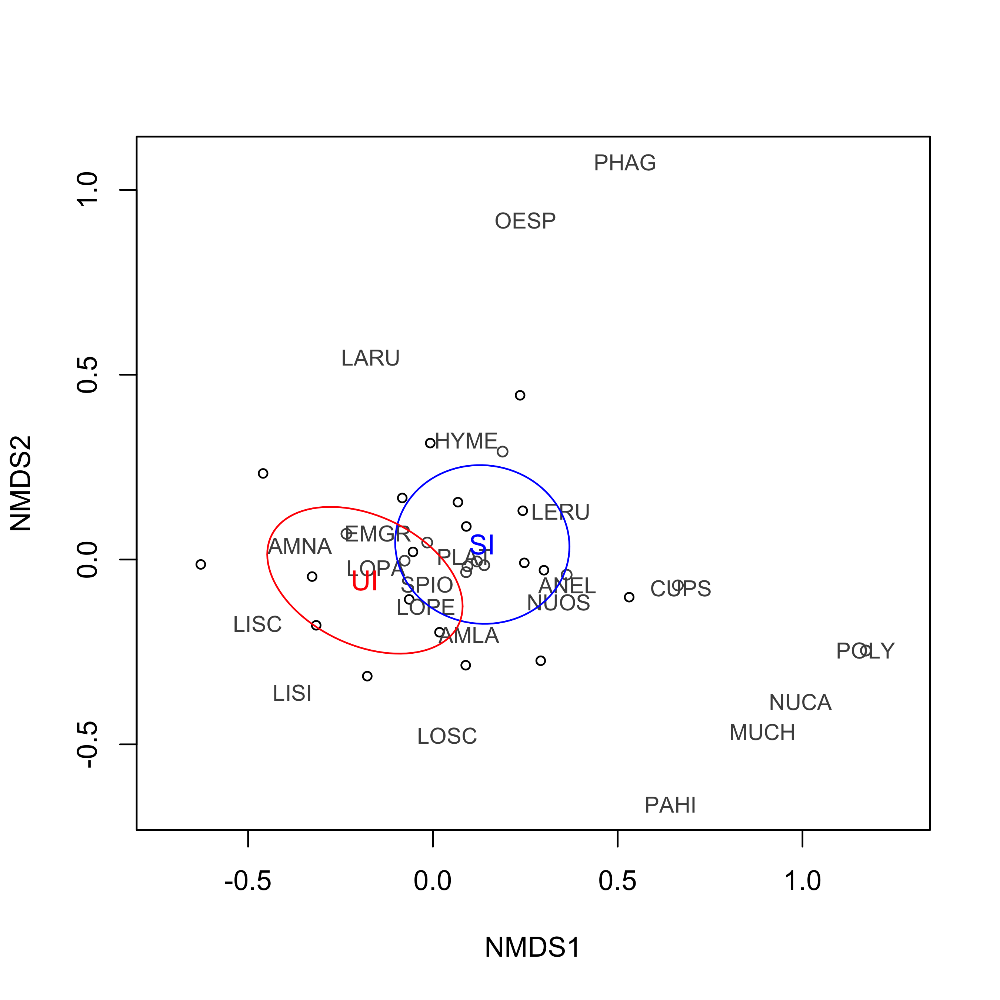
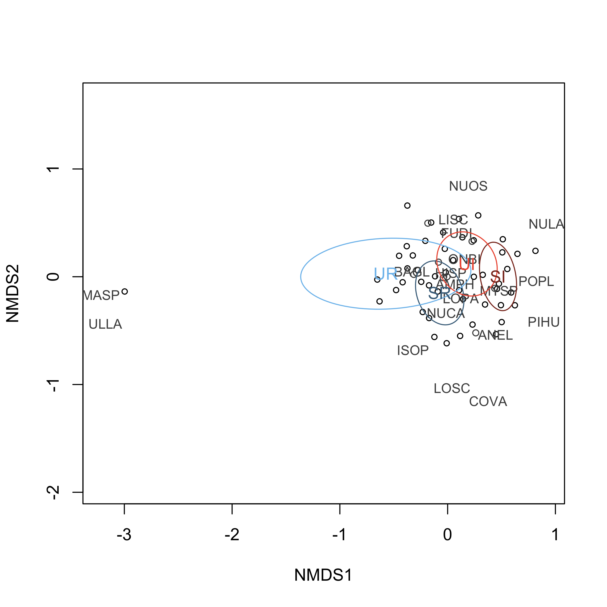

# Objectives

This experiment is designed to document how communities differ (in terms of Shannon diversity, species richness, and total abundance of organisms) between Semibalanus beds that are shaded vs. unshaded during the summer season. Shades reduce temperature (and desiccation stress). I also scraped a subset of plots to see how early succession is affected by the presence or absence of shades.

I want to examine: 1) How communities differ in mulitdimensional space between treatments - what is their dispersion, and how far apart are they? 2) How Shannon diversity differs 3) How richness differs 4) How total abundance differs

# Temperature data

```{r, message=F, results="hide", warning=FALSE}

library(tidyverse)
library(lubridate)
library(car)
library(vegan)

temp.files <- list.files("../raw_data/ibutton_temp/")

temp.df.all.aug <- data.frame(matrix(ncol = 4))
colnames(temp.df.all.aug) <- c("Date/Time", "Unit", "Value", "file_name")

for (file in 1: length(temp.files)){
  file.name = paste("../raw_data/ibutton_temp/", temp.files[file], sep = "")
  temp.df <- read_csv(file.name, skip = 14) %>% mutate(file_name = temp.files[file])
  if (str_detect(file.name, "07")==TRUE){
    if (file == 1){
    temp.df.all.july <- temp.df
  }
  if (file > 1){
    temp.df.all.july <- rbind(temp.df.all.july, temp.df)
  }
  }
  else {
    temp.df.all.aug <- rbind(temp.df.all.aug, temp.df)
  }
}

temp.df.clean.july <- temp.df.all.july %>% mutate(Value = str_remove_all(Value, "C,")) %>% separate(file_name, sep = "_", into = c("block","treatment","extra")) %>% select(-extra) %>% rename(date = 1, time = 2, temperature_C = 3) %>%
mutate(time = toupper(str_remove_all(time, fixed(".")))) %>% mutate(time = parse_time(time, "%I:%M:%S %p")) %>% unite(date_time, c(date, time), sep = " ") %>% mutate(date_time = as_datetime(date_time), temperature_C = as.numeric(temperature_C))

temp.df.clean.aug <- temp.df.all.aug %>% na.omit() %>% select(-Unit) %>% separate(file_name, sep = "_", into = c("block","treatment","extra")) %>% select(-extra) %>% rename(date_time = 1, temperature_C = 2) %>% mutate(date_time = parse_date_time(date_time, "%d/%m/%y %I:%M:%S %p"))

temp.clean <- temp.df.clean.aug %>%  full_join(temp.df.clean.july) %>% mutate(treatment = case_when(treatment == 1 ~ "UI", treatment == 2 ~ "SI", treatment == 3 ~ "UR", treatment == 4 ~ "SR")) %>% filter(date_time < "2021-08-21 6:00:00" & date_time > "2021-04-17 15:00:00") %>% unique()

#write_csv(temp.clean, "../clean_data/SBHW_temp_clean.csv")

# isolate low tide data only

temp.rounded <- temp.clean %>% mutate(hour = hour(date_time)) %>% separate(date_time, into = c("date","time"), sep = " ") %>% unite(date_time, c(date, hour), sep = " ") %>% mutate(date_time = ymd_h(date_time)) %>% select(-time) 

tides_cc <- read_delim("../raw_data/tides/tides_all_summer_CC.csv", col_names = c("date","junk","time","tz","tide_height_ft"), delim = " ") %>% mutate(hour = hour(time)) %>% select(-junk, -tz, -time) %>% unite(date_time, c(date, hour), sep = " ") %>% mutate(date_time = ymd_h(date_time), tide_height_m = tide_height_ft * 0.3048) %>% select(-tide_height_ft)

temp.lowtide <- temp.rounded %>% left_join(tides_cc) %>% filter(tide_height_m <= 1.4)

```

```{r}

temp.sep <- temp.lowtide %>% separate(date_time, into = c("date","time"), sep = " ", remove = F)

temp.hourly <- temp.lowtide %>% group_by(date_time, treatment) %>% summarize(mean_temp = mean(temperature_C)) %>% separate(date_time, into = c("date","time"), sep = " ", remove = F) %>% mutate(date_time = ymd_hms(date_time))

temp.summary <- temp.sep %>% group_by(date, treatment) %>% summarize(mean_temp = mean(temperature_C), max_temp = max(temperature_C)) %>% mutate(date = date(date))

ggplot(data = temp.summary %>% filter(date >= "2021-06-01" & date < "2021-07-15") , aes(x = date, y = max_temp, col = treatment)) + geom_line() + scale_color_manual(values = c("skyblue4","skyblue2", "tomato4", "tomato2")) + labs(x = "Date", y = "Mean daily max temperature (ºC)", color = "Treatment") + theme(axis.title = element_text(size = 14), axis.text = element_text(size = 12), legend.text = element_text(size = 12), legend.title = element_text(size = 14)) + theme_bw()

View(temp.clean)

```

The temperature is highest in the unshaded treatments (as expected) by (at times) a substantial margin. What does this break down to in a boxplot sense?

```{r}

temp.summary2 <- temp.sep %>% group_by(treatment, date) %>% summarize(mdmax_temp = max(temperature_C)) %>% mutate(trt_long = case_when(treatment == "SI" ~ "shaded intact", treatment == "UI" ~ "unshaded intact", treatment == "SR" ~ "shaded removal", treatment == "UR" ~ "unshaded removal"))

ggplot(data = temp.summary2 %>% filter(mdmax_temp < 50), aes(x = treatment, y = mdmax_temp, col = trt_long)) + geom_boxplot() + scale_color_manual(values = c("skyblue4","skyblue2", "tomato4", "tomato2")) + labs(x = "Date", y = "Mean maximum daily temperature (ºC)", color = "Treatment") +  theme(axis.title = element_text(size = 14), axis.text = element_text(size = 12), legend.text = element_text(size = 12), legend.title = element_text(size = 14)) + theme_bw()

```

There's something odd going on here with one of the SI plots. Need to look into it a bit more. Solved! Excluded one plot that was problematic.

```{r}
require(car)
require(lme4)

temp.model <- lmer(temperature_C ~ treatment*date_time + (1|block), data = temp.lowtide)

summary(temp.model)

Anova(temp.model)

max.temp.model <- lm(mdmax_temp ~ treatment, data = temp.summary2)

TukeyHSD(aov(mdmax_temp ~ treatment, data = temp.summary2))
summary(max.temp.model)
Anova(max.temp.model)

```

# Infaunal community

```{r, message = F, results = "hide"}
library(vegan)

collection.info <- read_csv("../raw_data/shade/SBC_SHADE_plot_info.csv")
survey.info <- read_csv("../raw_data/shade/SBC_SHADE_survey_info.csv")

infauna.shade <- read_csv("../raw_data/shade/SBC_SHADE_infauna.csv") %>% rename(plot_number = plot_id) %>% left_join(collection.info) %>% rename(treatment = treatment_original_numeric) %>% mutate(treatment = case_when(treatment == 1 ~ "UI", treatment == 2 ~ "SI", treatment == 3 ~ "UR", treatment == 4 ~ "SR")) %>% select(-shore_level, -treatment_final_numeric)

#get rid of everything and convert to matrix
infauna.matrix <- infauna.shade %>% 
  select(-plot_number, -block, -treatment)
  
# convert to matrix
infauna.matrix <- as.matrix(infauna.matrix)

# ready to analyze
comm.infauna <- metaMDS(infauna.matrix, k = 2, try = 400)

# can't get ordplot to display in .Rmd file

factors.infauna <-infauna.shade %>% select(treatment, block)

perm.y1 <- adonis(infauna.matrix ~ treatment, data = factors.infauna,
                  perm = 99)

dist.y1 <- vegdist(infauna.matrix, method = "bray")
disp.y1 <- betadisper(dist.y1, type = "centroid", group = factors.infauna$treatment)

```

```{r}
perm.y1
anova(disp.y1)
boxplot(disp.y1)
```

```{r, echo = F}


```

# Mortality in shaded vs. unshaded

```{r, message = F, results = "hide"}
barnacle.mort <- read_csv("../raw_data/shade/SBC_SHADE_semibalanusmort.csv") %>% mutate(prop_mort = (number_dead)/(number_live+number_dead)) %>% filter(prop_mort != "NaN")

plot.info <- read_csv("../raw_data/shade/SBC_SHADE_plot_info.csv")

mort.complete <- barnacle.mort %>% left_join(plot.info) %>% filter((plot_number %in% c(15,35,36,40)) == F) %>% select(prop_mort, treatment_original_numeric, plot_number, block) %>% rename(treatment = treatment_original_numeric) %>% mutate(treatment = case_when(treatment == 1 ~ "UI", treatment == 2 ~ "SI"))

mort.beds <- mort.complete %>% filter(treatment %in% c("SI","UI"))

shade.mort.model <- glm(prop_mort ~ treatment, family = "binomial", data = mort.beds)

plot(shade.mort.model)

shade.mort.model.weights <- glm(prop_mort ~ treatment, family = "binomial", weights = treatment, data = mort.beds %>% mutate(treatment = case_when(treatment == "UI" ~ 1, treatment == "SI" ~ 2)))

AIC(shade.mort.model, shade.mort.model.weights)

# no weights

summary(shade.mort.model)
Anova(shade.mort.model)

```

```{r}
summary(shade.mort.model)

ggplot(mort.beds %>% mutate(treatment = case_when(treatment == "SI" ~ "shaded", treatment == "UI" ~ "unshaded")), aes(x = treatment, y = prop_mort, col = treatment)) + geom_boxplot() +  theme(axis.title = element_text(size = 14), axis.text = element_text(size = 12)) + theme_bw() + scale_color_manual( values = c("skyblue4", "tomato4")) + labs(x = "Treatment", y = "Mortality (%)",col = "Treatment") + theme(legend.position = "none")

```

Clearly, having a shade positively affected barnacle survival. What about species richness/diversity based on visual surveys??

```{r,message = F, results = "hide"}

visuals <- read_csv("../raw_data/shade/SBC_SHADE_visual_3_202108.csv")

# separate the cover and count data

taxa <- read_csv("../raw_data/SBC_taxonomic_20211026.csv") %>% select(taxon_code, kingdom)

algae <- taxa %>% filter(kingdom != "Animalia") %>% select(-kingdom)
animal <- taxa %>% filter(kingdom == "Animalia") %>% select(-kingdom)

# algal diversity & abund

visuals.long <- visuals %>% pivot_longer(cols = c(2:length(visuals)), names_to = "taxon_code", values_to = "abund")

visuals.algae <- visuals.long %>% right_join(algae) %>% pivot_wider(names_from = "taxon_code", values_from = "abund") %>% select(-ULSP) %>% na.omit()

H <- diversity(visuals.algae)
total_cover <- rowSums(visuals.algae %>% select(-plot_number))

diversity.algae <- cbind(visuals.algae$plot_number, H, total_cover)
colnames(diversity.algae) <- c("plot_number","H", "total_cover")
diversity.algae <- as.data.frame(diversity.algae)

diversity.algae.trts <- diversity.algae %>% full_join(plot.info) %>% select(-plot_number, -treatment_final_numeric, -shore_level) %>% rename(treatment = treatment_original_numeric) %>% mutate(treatment = case_when(treatment == 1 ~ "UI", treatment == 2 ~ "SI", treatment == 3 ~ "UR", treatment == 4 ~ "SR"))

# animal diversity & abund

visuals.animals <- visuals.long %>% right_join(animal)  %>% pivot_wider(names_from = "taxon_code", values_from = "abund") %>% mutate_all(~replace_na(.,0)) %>% select(-c(GNOR:NEVE)) %>% na.omit()

H <- diversity(visuals.animals)
abund <- rowSums(visuals.animals %>% select(-plot_number))

diversity.animals <- cbind(visuals.animals$plot_number, H, abund)
colnames(diversity.animals) <- c("plot_number","H", "abund")
diversity.animals <- as.data.frame(diversity.animals)

diversity.animals.trts <- diversity.animals %>% full_join(plot.info) %>% select(-plot_number, -treatment_final_numeric, -shore_level) %>% rename(treatment = treatment_original_numeric) %>% mutate(treatment = case_when(treatment == 1 ~ "UI", treatment == 2 ~ "SI", treatment == 3 ~ "UR", treatment == 4 ~ "SR"))

richness.all.taxa <- cbind(visuals$plot_number, specnumber(visuals))
colnames(richness.all.taxa) <- c("plot_number", "richness")
richness.all.taxa <- as.data.frame(richness.all.taxa)

richness.all.trts <- richness.all.taxa %>% full_join(plot.info) %>% select(-plot_number, -treatment_final_numeric, -shore_level) %>% rename(treatment = treatment_original_numeric) %>% mutate(treatment = case_when(treatment == 1 ~ "UI", treatment == 2 ~ "SI", treatment == 3 ~ "UR", treatment == 4 ~ "SR"))

```

# Plots of diversity & abundance

## 1: Species richness, all taxa

```{r}
ggplot(richness.all.trts, aes(x=treatment, y = richness, color = treatment)) + geom_boxplot() + labs(y = "Species richness", x = "Treatment") + scale_color_manual(values = c("skyblue4","skyblue2", "tomato4", "tomato2")) +  theme(axis.title = element_text(size = 14), axis.text = element_text(size = 12), legend.text = element_text(size = 12), legend.title = element_text(size = 14)) + theme_bw()
```

## 2: Animals only: Shannon diversity & total abundance

```{r}
ggplot(diversity.animals.trts, aes(x=treatment, y = H, color = treatment)) + geom_boxplot() + scale_color_manual(values = c("skyblue4","skyblue2", "tomato4", "tomato2")) +  theme(axis.title = element_text(size = 14), axis.text = element_text(size = 12), legend.text = element_text(size = 12), legend.title = element_text(size = 14)) + theme_bw()
```

```{r}
ggplot(diversity.animals.trts, aes(x=treatment, y = abund, color = treatment)) + geom_boxplot() + scale_color_manual(values = c("skyblue4","skyblue2", "tomato4", "tomato2")) +  theme(axis.title = element_text(size = 14), axis.text = element_text(size = 12), legend.text = element_text(size = 12), legend.title = element_text(size = 14)) + theme_bw()
```

This trend is driven by barnacle recruitment, which was REALLY high in shaded removal plots. Might be worth digging into further??

```{r}

richness <- lm(richness ~ treatment, data = richness.all.trts)
summary(richness)
Anova(richness)

```

```{r}
animal.diversity <- lm(H ~ treatment, data = diversity.animals.trts)
summary(animal.diversity)
Anova(animal.diversity)
```

```{r}

animal.abundance <- lm(abund ~ treatment, data = diversity.animals.trts)
summary(animal.abundance)
Anova(animal.abundance)
```

## 3: Algal diversity & cover

```{r}
ggplot(diversity.algae.trts, aes(x=treatment, y = H, color = treatment)) + geom_boxplot() + scale_color_manual(values = c("skyblue4","skyblue2", "tomato4", "tomato2")) +  theme(axis.title = element_text(size = 14), axis.text = element_text(size = 12), legend.text = element_text(size = 12), legend.title = element_text(size = 14)) + theme_bw()
```

```{r}
ggplot(diversity.algae.trts, aes(x=treatment, y = total_cover, color = treatment)) + geom_boxplot() + scale_color_manual(values = c("skyblue4","skyblue2", "tomato4", "tomato2")) +  theme(axis.title = element_text(size = 14), axis.text = element_text(size = 12), legend.text = element_text(size = 12), legend.title = element_text(size = 14)) + theme_bw()
```

```{r}
algal.diversity <- lm(H ~ treatment, data = diversity.algae.trts)
summary(algal.diversity)
Anova(algal.diversity)
```

```{r}

algal.cover <- lm(total_cover ~ treatment, data = diversity.algae.trts)
summary(algal.cover)
Anova(algal.cover)
```

Moral of the story: The animal component of the community seems way more affected than the algal component.

## Visual surveys NMDS

```{r, message=FALSE, results = "hide"}
comm.visual <- visuals %>% select(-plot_number)
comm.visual.matrix <- as.matrix(comm.visual)

comm.visual.shade <- metaMDS(comm.visual.matrix, k = 2, try = 400)

treatments.codes <- as.data.frame(plot.info$treatment_original_numeric) %>% rename(treatment_number = 1) %>% mutate(treatment_code = case_when(treatment_number == 1 ~ "UI", treatment_number == 2 ~ "SI", treatment_number == 3 ~ "UR", treatment_number == 4 ~ "SR"))
```

```{r}

```

```{r, results ="hide",message=FALSE}
perm.y1 <- adonis(comm.visual.matrix ~ treatment_code, data = treatments.codes, perm = 99)
perm.y1

dist.y1 <- vegdist(comm.visual.matrix, method = "bray")

disp.y1 <- betadisper(dist.y1, type = "centroid", group = treatments.codes$treatment_code)
anova(disp.y1)

boxplot(disp.y1, xlab = "Treatment")

```

## Barnacle recruitment in empty plots

```{r}


```


